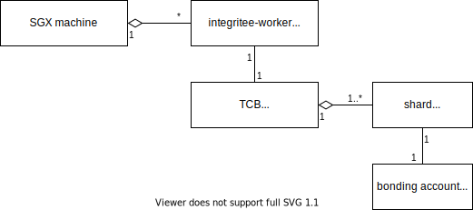

# Sharding

SubstraTEE isolates confidential state from the blockchain by maintaining it off-chain and processing it in TEEs. This strategy allows application-specific sharding. Every use case can work on its own shard and even one use case could split into several shards.

By default, SubstratTEE uses the MRENCLAVE of the worker enclave as shard identifier, so in most cases, your shard is directly linked to your specific TCB and there's nothing you have to worry about.

If you want to use your TCB for more than one use case, you might want to split into shards.

A single SGX HW can run many worker instances, all operating on different shards (and possibly even different TCBs).
